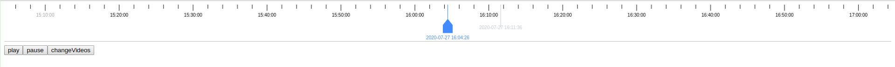

#Result


#Getting Started
```
npm i ngx-video-timeline --save
```
#Usage
Import the module into your module
```
import { BrowserModule } from '@angular/platform-browser';
import { NgModule } from '@angular/core';

import { AppComponent } from './app.component';
import { TimelineModule } from 'projects/timeline/src/lib/timeline.module';

@NgModule({
    declarations: [
        AppComponent
    ],
    imports: [
        BrowserModule,
        TimelineModule
    ],
    providers: [],
    bootstrap: [AppComponent]
})
export class AppModule { }

```
then use it in html
```
<ngx-video-timeline 
    class="canvas"
    [speed]="speed" 
    [playTime]="playTime" 
    [isPlayClick]="isPlayClick" 
    [videoCells]="videoCells" 
    [startTimeThreshold]="startTimeThreshold" 
    [endTimeThreshold]="endTimeThreshold" 
    [canvasHeight]="canvasHeight" 
    (playClick)="onPlayClick($event)"
>
</ngx-video-timeline>
```
in ts file
```
import { Component, OnInit } from '@angular/core';
import { VideoCellType } from 'projects/timeline/src/lib/timeline.component';

@Component({
    selector: 'app-root',
    templateUrl: './app.component.html',
    styleUrls: ['./app.component.scss']
})
export class AppComponent implements OnInit {
    title = 'ngx-video-timeline';

    speed: number;
    canvasHeight: number;
    startTimeThreshold: number;
    endTimeThreshold: number;
    videoCells: VideoCellType[];
    playTime: Date;
    isPlayClick: boolean;

    constructor() {
        this.speed = 10;
        this.isPlayClick = false;
        this.canvasHeight = 80;
        this.startTimeThreshold = new Date().getTime() - 1 * 3600 * 1000;
        this.endTimeThreshold = new Date().getTime() + 1 * 3600 * 1000;
        this.videoCells = [];
        this.playTime = new Date();
    }

    onPlay(): void {

        this.isPlayClick = true;
        this.startTimeThreshold = new Date().getTime() - 1 * 3600 * 1000;
    }

    onPause(): void {

        this.isPlayClick = false;
        // this.endTimeThreshold = new Date().getTime() + 1 * 3600 * 1000;
    }

    onPlayClick(date: number): void {
        // console.log(new Date(date));
        // this.canvasHeight = 60;
    }


    selectedTime(date: any): void {
        this.playTime = date.value;
    }

    changeVideo(): void {
        this.videoCells = [
            {
                beginTime: new Date().getTime() - 1 * 3600 * 1000,
                endTime: new Date().getTime() + 1 * 3600 * 1000,
                style: {
                    background: '#f3e5e4'
                }
            }
        ];
    }

    ngOnInit(): void {
    }
    onDragStart(): void {
        
    }
}

```
## API

|               Name               |      Type      |        Default/Return        |          Description          |
| :------------------------------: | :------------: | :--------------------------: | :---------------------------: |
|           [canvasHeight]           |      number       |             50             |            Canvas height (not less than 50)             |
|            [playTime]             | number,string,Date |        new Date().getTime() - 1 * 24 * 3600 * 1000        |           Playback time (default: the previous day)            |
|           [speed]            |    number     |            1             |        The video plays at twice the speed         |
|           [forWardValue]            |    number     |            1             |        Fast forward/fast backward video         |
|        [startTimeThreshold]         |    number,string,Date     |            new Date().getTime() - 1 * 12  * 3600 * 1000             |     Left time threshold      |
|          [endTimeThreshold]           |     number,string,Date      |           new Date().getTime() + 1 * 12  * 3600 * 1000            |         Right time threshold          |
|           [videoCells]           |     VideoCellType[]     |              VideoCellType[]              | Video block (shown in different colors) |
|           [borderColor]           |     string     |              "#fff"              | color of canvas border |
|           [bgColor]           |     string     |              "#fff"              | color of canvas backgraound |
|           [bottomLineColor]           |     string     |              "rgba(0,0,0,1)"              | color of the bottomLine |
|           [verticalBarColor]           |     string     |              "rgba(0,0,0,1)"              | color of the verticalBar |
|           [playBarColor]           |     string     |              "#448aff"              |  color of the playBar |
|          (playClick)           |      any       | playTime(Current timestamp) |       PlayTime starts playing at speed      |
|          (mouseUp)           |      any       | returnTime(Current timestamp) |       Returns the current time when the mouse is released       |
|          (mouseDown)           |      any       | returnTime(Current timestamp) |       Returns the current time when the mouse is pressed       |

## Interfate VideoCellType

|  field  |       name       |    type    | Required/optional |       default       |
| :----: | :--------------: | :--------: | :-------: | :----------------: |
| beginTime  |     The start time     |   number,string   |   required    |     undefined      |
| endTime  |    The end of time    |   number,string   |   required    |     undefined      |
| style | The background color |  boolean   |   optional    |        VideoCellStyleType        |
## Interfate VideoCellStyleType

|  field  |       name       |    type    | required/optional |       default       |
| :----: | :--------------: | :--------: | :-------: | :----------------: |
| background  |     The background color     |   string   |   required    |     undefined      |

#License
ngx-video-timeline is licensed under a [MIT License](https://opensource.org/licenses/MIT).
